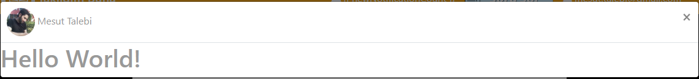

# MT.BootstrapLazyloader.js
Lazy Loader For Bootstrap Tabs, Pills and Modals

This package adds lazyloading option to bootstrap tabs, pills and modals so contents will load when the user clicks it.

**NOT** To use with bootstrap 4 lazyload modal set **MTLazyloadBootstrapVersion = 4** in global scope.

## How To Use

## Install

If you use nuget package manager, write down this command in nuget package manager console

<code>Install-Package MT.BootstrapLazyLoader.js</code>

If yout use Bower package manager, write down this command:

<code>bower install mt-bootstraplazyloader</code>

This packages also depends on: <br />
Jquery >=2.0.0<br />
Bootstrap >=3.0.0<br />
FontAwsome >=4.2.0<br />

If you don't use nuget package manager, just download source code, and copy MT.BootstrapTabsLazyLoader.js into your scripts folder.


## Using

Add a reference to **/Scripts/MT.BootstrapLazyLoader.js** to the scripts part of your code, after **jquery.js** and **bootstrap.js**

**A) Tabs**

A1)- For Using MT.BootstrapLazyloader with tabs, add **.lazyload** class to nav-tabs (bootstrap tabs ul tag)

A2)- add **data-url** to the **anchor** tag of every tab you want to lazyload. this attribute will contain the url of partial pages you want to load it into the tab.  

**B) Pills**

B1) For Using MT.BootstrapLazyloader with pills, add **.lazyload** class to nav-pills (bootstrap pills ul tag)

B2) add **data-url** to the **anchor** tag of every tab you want to lazyload. this attribute will contain the url of partial pages you want to load it into the tab.  

**C) Modal**

C1) For Using MT.BoostrapLazyloader with modals, add **.lazyload** and **.showModal** classes to the element that will show modal when clicked.

C2) add **data-header** to define the Modal's Header.

C3) add **data-size** to define the Modal's size. (Example: data-size="modal-lg", don't set it if you want default size.)

C4) If you are using lazyload modal on an Anchor element, the **href** attribute will be used as **url** and you don't need to add extra data-url.

C5) By Default the Id For lazyload modal is *"LazyloadModal"*, but you can add **id** attribute to the tag that will used to toggle modal, so the id for modal will be
Id + "Modal". with adding id to the toggle you can open multiple inner modals.

C6) **(New)** to prevent modal from closing by clicking the close button, pressing 'Esc' key or by clicking outside of the modal, you just need to add **data-closedisabled='false'**.

C7) **(New)** Now you can define a header template target for modal, this is useful if you want to place a customized html in header. for this you should replace **data-header** with **data-header-template** attribute and the value should be a css selector like '#idOfDomElementsThatContainsHtml' or any css selector.

Exmaple Result:



**Note: Modal's Markup will automatically append to body, and you don't need to add Modal's markup to body manually.**

**Callback function after Ajax Loaded**

The **data-callback** attribute can be used to specify a javascript function to be called once the load is done (on the .done() event of the $.get)


**Example 1**

*applied for nav-tabs and nav-pills*

    
    <!-- Nav tabs -->
    <ul class="nav nav-tabs lazyload">
        <li class="active"><a href="#fullDesc" data-toggle="tab">Description</a></li>
        <li><a href="#specificationDetails" data-toggle="tab">Specifications</a></li>
        <li><a href="#relatedProducts" data-toggle="tab" data-url="@Url.Action("relatedproducts", new { Model.Product.Id})">Related Products</a></li>
        <li><a href="#files" data-toggle="tab" data-url="@Url.Action("getproductfiles", new { Model.product.Id })" data-callback="initProducts()">Product Files</a></li>
        <li><a href="#videos" data-toggle="tab" data-url="@Url.Action("getproductvideos", new { Model.product.Id })">Product Videos</a></li>
    </ul>
    

note: If you are lazy loading your initial tab, you can add a trigger('shown.bs.tab') on your initial tab.

**MVC Example on the same page as your tabs**
```
@section scripts {
        <script type="text/javascript">
            $(document).ready(function () {                
                $('.nav-tabs a[href="#fullDesc"]').trigger('shown.bs.tab');
            });
        </script>
}
```


**Example 2**

```
<button class="lazyload showModal" data-url="@Url.Action("PreviewProduct", new {id=Model.product.Id})"
     data-header="Preview Product" data-size="modal-lg" data-callback="initProducts()">Preview</button>
```


*The Returned Partial View Content:*

```
<div class="modal-body">
    <!--Contents goes here-->    
</div>
<div class="modal-footer">
        <!--footer buttons goes here-->
        <button type="button" class="btn btn-default" data-dismiss="modal">Close</button>
        <button type="submit" class="btn btn-primary">Save changes</button>
</div >

```

